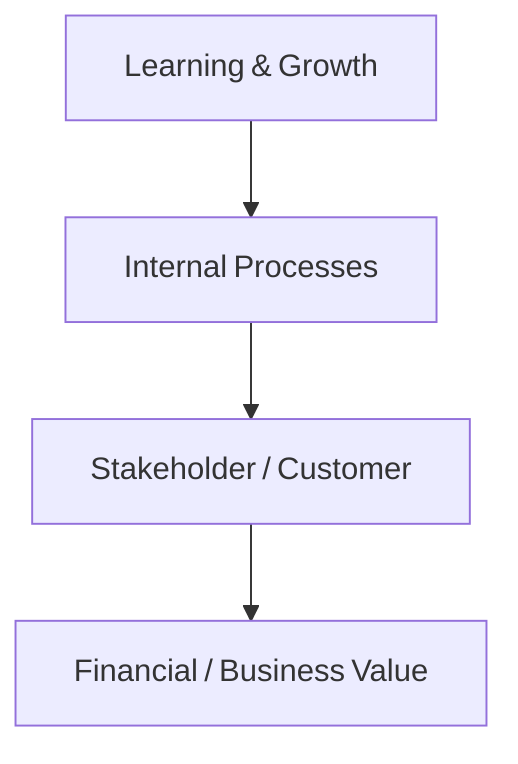

# Balanced Scorecard for Responsible AI Adoption

## 1. Objective
Integrate Responsible AI goals into enterprise performance management using a balanced‑scorecard approach.

---

## 2. Strategy Map

---

## 3. Balanced Scorecard
| Perspective | Strategic Objective | KPI / Metric | Target | Owner |
|--------------|--------------------|--------------|---------|--------|
| **Learning & Growth** | Build Responsible AI skills | % employees trained | ≥ 90 % annually | HR / Governance Lead |
|  | Foster AI ethics culture | # ethics sessions / year | ≥ 4 | Governance Committee |
| **Internal Processes** | Embed policy‑as‑code controls | % deployments with governance gate pass | 100 % | MLOps Manager |
|  | Improve incident response maturity | Mean time to contain Sev 1 | ≤ 1 h | Risk Manager |
| **Stakeholder / Customer** | Increase trust & transparency | Stakeholder trust score / 10 | ≥ 8 | Product Owner |
|  | Enhance fairness & accessibility | Bias gap % difference | ≤ 5 % | Data Science Lead |
| **Financial / Business Value** | Optimize AI ROI with compliance | ROI % per AI project | ≥ 15 % | CFO / Program Mgr |
|  | Reduce regulatory risk cost | # non‑conformities / year | 0 | Compliance Officer |

---

## 4. Governance and Review
| Activity | Frequency | Participants |
|-----------|------------|---------------|
| Scorecard update & metric validation | Quarterly | Governance Lead + C‑suite |
| Strategy review & alignment | Bi‑annual | Exec Committee |
| Policy & KPI refresh cycle | Annual | Governance Office + Finance |

---

## 5. Data Sources
- Learning management system (LMS) records  
- MLOps and governance pipelines  
- Incident register + RCA reports  
- Stakeholder surveys / feedback tools  
- Financial system ROI calculations  
- Compliance audit logs

---

## 6. Success Indicators
- Balanced scorecard published and reviewed quarterly.  
- KPIs linked to executive objectives and bonuses.  
- Documented evidence supports ISO 42001 and EU AI Act audits.  
- Positive trend in trust, skills, and ROI metrics year‑over‑year.
