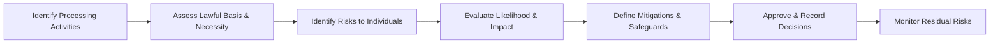

# DPIA / TRA + Data Governance Pack

## 1. Purpose
Define a repeatable Data Protection Impact Assessment (DPIA) and Technical Risk Assessment (TRA) process integrated into AI lifecycle governance.

---

## 2. DPIA Workflow

---

## 3. DPIA Template
| Section | Description |
|----------|--------------|
| **Activity Name** | Short title / ID |
| **Purpose & Scope** | Reason for processing data |
| **Data Types Processed** | Personal / Sensitive / Derived |
| **Lawful Basis** | Consent / Contract / Legitimate interest / Legal obligation |
| **Stakeholders Affected** | Users, customers, employees, third parties |
| **Risks to Individuals** | Privacy breach, unfair profiling, discrimination |
| **Mitigations** | Anonymization, encryption, differential privacy, review workflows |
| **Residual Risk** | Low / Medium / High |
| **Approval & Date** | Governance Lead / DPO signature |

---

## 4. Technical Risk Assessment (TRA)
| Risk Category | Description | Impact | Likelihood | Mitigation |
|----------------|-------------|---------|-------------|-------------|
| **Model Risk** | Model bias, hallucination, robustness gaps | High | Medium | Bias testing, guardrails |
| **Data Risk** | Poor quality or lineage | Medium | Medium | Data validation & documentation |
| **Infrastructure Risk** | Cloud failure, cost spikes | Medium | Low | Multi-region redundancy |
| **Security Risk** | Unauthorized access or prompt injection | High | Medium | IAM, isolation, sandboxing |
| **Operational Risk** | Poor monitoring or change control | Medium | Medium | CI/CD policy-as-code, audit trail |

---

## 5. Data Governance Checklist
| Domain | Control | Evidence |
|---------|----------|-----------|
| Data Inventory | Centralized register with owner & retention | Data catalog |
| Data Quality | Validation rules, missing value handling | Data quality reports |
| Data Lineage | Track source → transformation → model | Lineage diagrams |
| Data Retention | Define retention + disposal policy | Retention matrix |
| Access Control | RBAC, least privilege enforcement | IAM logs |
| Anonymization | Apply k-anonymity / DP noise where needed | DP config file |
| Consent & Rights | Mechanism for opt-out, correction, deletion | Privacy portal |

---

## 6. Monitoring & Review
- DPIA reviewed annually or upon change in processing scope.  
- TRA refreshed with each new model release.  
- Residual risks logged in the enterprise risk register.  
- Metrics tracked: open risks count, DPIA completion rate, mitigation closure SLA.

---

## 7. Success Indicators
- 100 % of AI systems with approved DPIA & TRA.  
- Residual risks ≤ Medium.  
- No substantiated privacy complaints or regulatory notices.