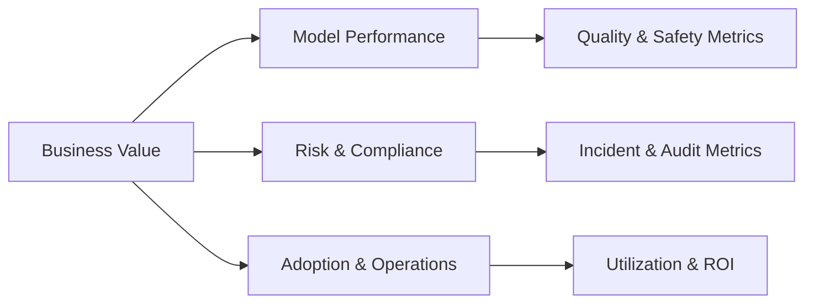

# Executive KPI Dashboard Specification

## 1. Objective
Provide a single view of AI program performance, governance effectiveness, and responsible AI outcomes for executive stakeholders.

---

## 2. Dashboard Structure

---

## 3. KPI Framework
| Dimension | Metric | Formula / Definition | Target | Data Source |
|------------|---------|----------------------|---------|--------------|
| **Business Value** | Cycle Time Reduction | (Baseline – Current) / Baseline | ≥ 25 % | Project reports |
|  | Cost Efficiency | Cost / Outcome | ↓ trend | Finance systems |
| **Model Quality** | pass@5 | # correct / total queries | ≥ 0.82 | Eval suite |
|  | Drift Index | PSI / JSD | < 0.2 | Monitoring logs |
| **Safety & Ethics** | Harmful Output Rate | flagged / total tests | ≤ 0.5 % | Red-team tests |
|  | Bias Gap | Δ performance subgroup vs overall | ≤ 5 % | Fairness eval |
| **Privacy & Security** | Privacy Incidents | Count | 0 | Incident register |
|  | Time to Contain (Sev 1) | Avg hours | ≤ 1 h | IR system |
| **Governance & Compliance** | Policy Update Lag | Days from law to code | ≤ 14 days | Policy tracker |
|  | Audit Closure Rate | Closed / total | ≥ 95 % in 30 days | Audit tool |
| **Adoption & Engagement** | Active Users | Weekly active / total | ↑ trend | Analytics |
|  | Satisfaction Score | Survey avg / 10 | ≥ 8 | Feedback tool |

---

## 4. Visual Layout
- **Top Panel:** Business Value cards (Cycle Time, ROI, Cost Efficiency)  
- **Middle Panel:** Model Performance (Accuracy, Drift, Safety, Fairness)  
- **Lower Panel:** Risk & Governance (Audits, Incidents, Policy Lag)  
- **Sidebar:** Adoption (Users, Satisfaction) + Compliance heatmap

---

## 5. Data Collection & Refresh
| Data Type | Source System | Refresh Frequency |
|------------|---------------|------------------|
| Model metrics | MLOps monitoring | Hourly |
| Business metrics | PMIS / ERP | Daily |
| Governance events | GRC tool | Daily |
| Audit data | Compliance portal | Weekly |
| User feedback | Survey tool | Monthly |

---

## 6. Governance
- Ownership: **Governance Lead**  
- Maintenance: **Data Ops Team**  
- Review cadence: monthly executive committee.  
- Evidence use: feeds ISO 42001 AIMS and EU AI Act monitoring records.

---

## 7. Success Indicators
- Executives can view all KPIs on a single screen.  
- KPI targets linked to business objectives.  
- Automated data feeds with < 5 % manual entry.  
- KPI performance reviewed each quarter with documented actions.