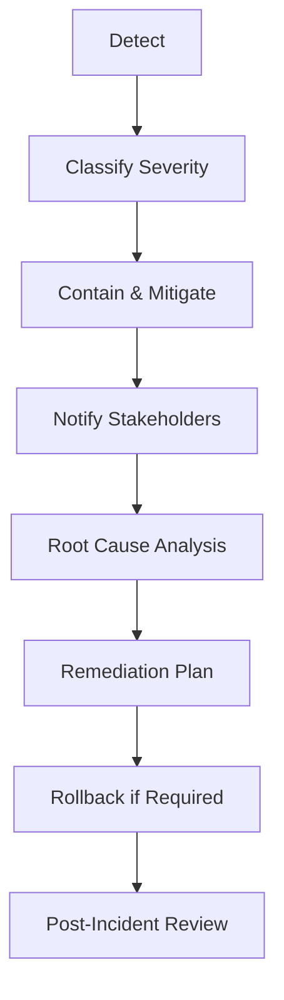

# Incident Response & Rollback Playbook

## 1. Purpose
Provide a structured response plan for AI system incidents, including harmful outputs, data breaches, or quality regressions.

---

## 2. Severity Matrix
| Severity | Description | Example | SLA |
|-----------|-------------|----------|-----|
| **Sev 1** | Critical – safety/privacy breach | Exposure of personal data | Contain within 1 h |
| **Sev 2** | Major – model quality or ethical failure | Harmful content, bias surge | RCA within 24 h |
| **Sev 3** | Minor – functional defect | Formatting / latency issue | Fix within 72 h |

---

## 3. Response Workflow

---

## 4. Immediate Containment Actions
- Disable affected endpoint or feature.  
- Apply safe-mode (reduced temperature, stricter prompt filters).  
- Rate-limit or redirect traffic.  
- Preserve evidence (logs, prompts, outputs).  
- Escalate to Governance Lead + Security Officer.

---

## 5. Root-Cause Analysis Template
| Field | Description |
|--------|--------------|
| **Incident ID / Date** |  |
| **System / Model Version** |  |
| **Trigger Event** | Summary of failure condition |
| **Root Cause Type** | Data / Model / Infra / Policy / Human Error |
| **Corrective Action** |  |
| **Preventive Action** |  |
| **Owner / Deadline** |  |

---

## 6. Rollback Procedure
1. Verify last-known-good model in registry.  
2. Trigger automated rollback pipeline (CI/CD).  
3. Notify stakeholders (Product, Risk, Compliance).  
4. Validate service health + metrics.  
5. Document change + closure.

---

## 7. Communication Protocol
| Audience | Channel | Timing |
|-----------|----------|---------|
| Internal (Governance, Legal, PR) | Incident ticket + email | Immediate |
| Regulators (if required) | Official notice | Within 72 h of confirmation |
| Customers / Partners | Managed statement via PR | After containment |

---

## 8. Post-Incident Review
- Conduct lessons-learned workshop within 5 days.  
- Update evaluation suite + policy-as-code rules.  
- Refresh training materials.  
- Archive incident in risk register.

---

## 9. Metrics
| Metric | Target |
|---------|---------|
| Time to Contain | ≤ 1 h (Sev 1) |
| RCA Completion Time | ≤ 24 h |
| Repeat Incident Rate | < 5 % |
| Policy Update Lag | ≤ 7 days |

---

## 10. Success Indicators
- Zero open Sev 1 incidents.  
- RCA reports completed within SLA.  
- Updated playbook signed off by Governance Lead.