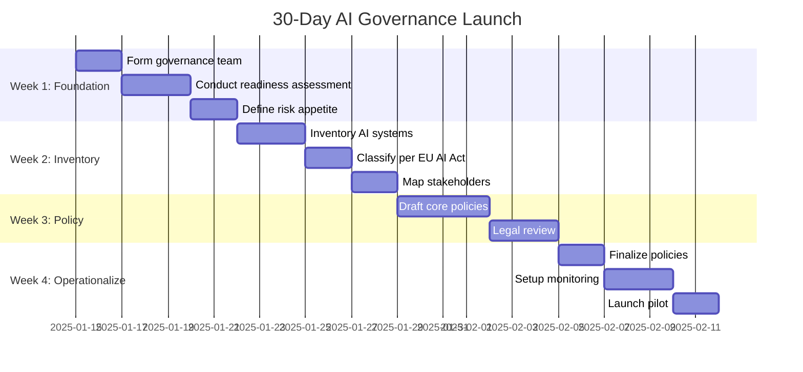

# Quick Start Guide: Launch AI Governance in 30 Days

## Overview

**Time Commitment:** 30 days  
**Audience:** AI governance leads, PMO, cross-functional teams  
**Outcome:** Operational governance framework with initial policies, processes, and pilot project

This guide provides a practical 30-day sprint to establish minimum viable AI governance. It's designed for organizations that need to move quickly while building a foundation for long-term governance maturity.

---

## Prerequisites

Before starting, ensure you have:
- [ ] **Executive sponsor** committed to AI governance initiative
- [ ] **Cross-functional team** (legal, IT, business, ethics) with 4-8 hours/week availability
- [ ] **Access to handbook materials** and templates
- [ ] **Initial AI use case** identified for pilot (optional but recommended)

**Resources Needed:**
- 40-60 hours of leadership/governance team time
- Access to current AI systems/plans inventory
- Legal/compliance stakeholder availability for reviews
- Basic project management tools (shared docs, task tracker)

---

## 30-Day Roadmap

---

## Week 1: Foundation (Days 1-7)

### Day 1-2: Form Governance Team

**Objective:** Assemble AI Governance Committee and assign roles

**Tasks:**
1. **Identify committee members** representing:
   - Legal/Compliance (1-2 people)
   - IT/Security (1-2 people)
   - Business/Domain experts (2-3 people)
   - Ethics/Risk (1 person)
   - Executive sponsor (1 person)

2. **Hold kickoff meeting** (90 minutes):
   - Review Executive Summary
   - Align on governance objectives and scope
   - Assign roles using PMI template (Handbook.md §2.2)
   - Establish meeting cadence (recommend 2x/week during sprint)

3. **Create shared workspace**:
   - Shared drive or collaboration platform
   - Copy handbook templates to workspace
   - Set up task tracker for 30-day plan

**Deliverables:**
- [ ] Committee roster with roles and responsibilities
- [ ] Meeting schedule for next 30 days
- [ ] Shared workspace with templates loaded

**Template:** Use Handbook.md §2.2 for role definitions

---

### Day 3-5: Conduct Readiness Assessment

**Objective:** Baseline organizational AI maturity and identify gaps

**Tasks:**
1. **Complete readiness questionnaire** (Handbook.md §2.4.1):
   - Have each committee member independently rate 12 questions
   - Aggregate scores and discuss discrepancies
   - Identify top 3-5 improvement priorities

2. **Assess maturity level** (Tutorial.md §2.2):
   - Determine current maturity stage (0-3)
   - Define target maturity for 6-12 months
   - Document capability gaps

3. **Identify training needs**:
   - Map skills gaps (AI literacy, governance, technical)
   - Plan training sessions for weeks 5-8

**Deliverables:**
- [ ] Completed readiness assessment with scores
- [ ] Prioritized improvement action plan
- [ ] Maturity baseline and target state

**Time Investment:** 4-6 hours committee time

---

### Day 6-7: Define Risk Appetite and Ethical Principles

**Objective:** Establish organizational risk tolerance and ethical guardrails

**Tasks:**
1. **Define ethical principles** (Handbook.md §2.3.1):
   - Review suggested principles: transparency, fairness, bias mitigation, privacy, accountability
   - Customize for organizational values and culture
   - Draft 1-page ethical principles document

2. **Set risk appetite** (Reference.md §2.4):
   - Adopt or customize risk scoring matrix (Severity × Likelihood)
   - Define thresholds for risk levels (low, moderate, high, critical)
   - Determine go/no-go criteria for each risk level

3. **Document decision authority**:
   - Who approves low-risk AI use cases?
   - Who reviews high-risk cases?
   - What triggers executive escalation?

**Deliverables:**
- [ ] Ethical principles document (1 page)
- [ ] Risk tolerance matrix with thresholds
- [ ] Decision authority matrix

**Time Investment:** 4-6 hours committee time

---

## Week 2: Inventory & Classification (Days 8-14)

### Day 8-10: Inventory AI Systems

**Objective:** Create comprehensive catalog of current and planned AI systems

**Tasks:**
1. **Inventory existing AI systems**:
   - Survey business units for AI tools in use
   - Include vendor solutions (ChatGPT, Copilot, etc.)
   - Document internal AI/ML models
   - Capture shadow AI (unapproved tools)

2. **Catalog planned AI initiatives**:
   - Review project portfolios and roadmaps
   - Interview product/program managers
   - Capture use cases in pipeline

3. **Document each system** using template:
   - System name and purpose
   - Owner/business unit
   - Vendor vs. internal
   - Data sources and sensitivity
   - Current stage (pilot, production, planned)

**Deliverables:**
- [ ] AI systems inventory (spreadsheet or database)
- [ ] Classification of shadow AI requiring governance review

**Template:** Adapt PMI Tool Inventory template (Handbook.md §2.4.3)

**Time Investment:** 6-10 hours (distributed across team)

---

### Day 11-12: Classify Per EU AI Act

**Objective:** Categorize AI systems by risk level per regulatory frameworks

**Tasks:**
1. **Review EU AI Act risk categories** (Handbook.md §1, Explanation.md):
   - Prohibited AI (social scoring, manipulation, etc.)
   - High-risk AI (employment, credit, critical infrastructure, etc.)
   - Limited-risk AI (chatbots, emotion recognition)
   - Minimal-risk AI (spam filters, recommendations)

2. **Classify each inventoried system**:
   - Apply risk category based on use case and impact
   - Flag high-risk systems for enhanced governance
   - Identify any prohibited use cases for immediate halt

3. **Assess GPAI obligations** (for generative AI):
   - Determine if using general-purpose AI models
   - Document transparency and safety requirements

**Deliverables:**
- [ ] Risk classification added to inventory
- [ ] List of high-risk systems requiring immediate action
- [ ] GPAI compliance requirements documented

**Time Investment:** 4-6 hours committee time

---

### Day 13-14: Map Stakeholders and Context

**Objective:** Identify impacted parties and understand system contexts

**Tasks:**
1. **Stakeholder mapping** (Handbook.md §2.3.2):
   - For each high-risk system, list affected stakeholder groups
   - Include internal (employees, management) and external (customers, partners)
   - Identify vulnerable or protected groups

2. **Context analysis** (ISO 42001 approach):
   - Internal factors: organizational culture, resources, legacy systems
   - External factors: regulations, market competition, societal expectations
   - Document assumptions and limitations

3. **Initial risk identification**:
   - Brainstorm potential harms for each system
   - Use bias analysis template (Handbook.md §2.3.2)
   - Capture risks in risk register

**Deliverables:**
- [ ] Stakeholder map for high-risk AI systems
- [ ] Context analysis summary
- [ ] Initial risk register entries

**Time Investment:** 4-6 hours

---

## Week 3: Policy Development (Days 15-21)

### Day 15-18: Draft Core Policies

**Objective:** Create essential AI governance policies customized for your organization

**Tasks:**
1. **Select policy templates** (Handbook.md §2.3):
   - AI usage policy (acceptable use, restrictions)
   - Data governance for AI (quality, privacy, security)
   - Model development standards (testing, documentation)
   - Monitoring and incident response

2. **Customize templates**:
   - Adapt language to organizational culture
   - Insert specific tools, systems, risk thresholds
   - Add industry-specific requirements (HIPAA, GLBA, etc.)
   - Ensure alignment with existing IT/data policies

3. **Define use case restrictions** (PMI template):
   - List tasks where AI may be used
   - List tasks where AI is restricted or prohibited
   - Provide rationale and guidelines for each

**Deliverables:**
- [ ] Draft AI usage policy (3-5 pages)
- [ ] Draft data governance addendum (2-3 pages)
- [ ] Use case restrictions table
- [ ] Model development standards checklist

**Time Investment:** 12-16 hours (distributed across subject matter experts)

---

### Day 19-21: Legal and Compliance Review

**Objective:** Validate policies meet regulatory and legal requirements

**Tasks:**
1. **Legal review** (coordinate with General Counsel):
   - Verify compliance with applicable regulations
   - Check for conflicts with existing policies
   - Assess liability and risk transfer provisions
   - Review intellectual property considerations

2. **Compliance validation**:
   - Ensure privacy law alignment (GDPR, CCPA, HIPAA)
   - Verify industry-specific requirements met
   - Check audit trail and documentation sufficiency

3. **Incorporate feedback**:
   - Revise policies based on legal input
   - Escalate unresolved issues to executive sponsor
   - Prepare final draft for approval

**Deliverables:**
- [ ] Legal sign-off on policies (or documented exceptions)
- [ ] Revised policy drafts incorporating feedback
- [ ] Compliance gap analysis (if any)

**Time Investment:** 8-12 hours legal/compliance time; 4-6 hours governance team revisions

---

## Week 4: Operationalize & Launch (Days 22-30)

### Day 22-23: Finalize Policies and Governance Plan

**Objective:** Complete and approve governance documentation

**Tasks:**
1. **Executive approval**:
   - Present policies to executive sponsor or leadership team
   - Incorporate final feedback
   - Obtain formal sign-off

2. **Finalize governance plan** (PMI structure):
   - Combine all components: purpose, principles, roles, policies, templates
   - Add review and update mechanisms
   - Define consequences of non-compliance

3. **Communication planning**:
   - Draft announcement for organization-wide rollout
   - Prepare FAQ document
   - Schedule training sessions

**Deliverables:**
- [ ] Approved AI governance plan (complete document)
- [ ] Executive sign-off documented
- [ ] Communication and training plan

**Time Investment:** 4-6 hours

---

### Day 24-27: Setup Monitoring and Risk Management

**Objective:** Implement tracking mechanisms for ongoing governance

**Tasks:**
1. **Establish risk register** (Handbook.md §2.4.2):
   - Transfer identified risks from Week 2 into formal register
   - Assign severity/likelihood scores
   - Document mitigation strategies and owners
   - Set review frequency

2. **Setup monitoring dashboard** (if tools available):
   - Track AI system usage and performance metrics
   - Monitor for policy violations
   - Configure alerts for threshold breaches

3. **Define intake process** (Handbook.md §2.4.4):
   - Create submission form for new AI tool requests
   - Establish evaluation criteria and timeline
   - Assign review responsibilities

**Deliverables:**
- [ ] Operational risk register with initial entries
- [ ] Monitoring dashboard or tracking spreadsheet
- [ ] Intake process documentation and submission form

**Time Investment:** 6-8 hours

---

### Day 28-30: Launch Pilot and Communicate

**Objective:** Begin governance operations with pilot project and announce to organization

**Tasks:**
1. **Select pilot project** (if not already identified):
   - Choose moderate-complexity AI initiative
   - Ensure cross-functional team engagement
   - Aim for 4-8 week pilot duration

2. **Apply governance framework to pilot**:
   - Walk through CPMAI phases (Handbook.md §2.3)
   - Use go/no-go checklist at each phase
   - Document lessons learned as you go

3. **Communicate governance launch**:
   - Send organization-wide announcement
   - Publish governance plan to shared location
   - Schedule Q&A sessions or office hours
   - Make intake form accessible

4. **Schedule first governance review**:
   - Set 30-day check-in (Day 60)
   - Plan quarterly review cadence

**Deliverables:**
- [ ] Pilot project launched under governance framework
- [ ] Organization-wide announcement sent
- [ ] Governance documentation published and accessible
- [ ] First review meeting scheduled

**Time Investment:** 4-6 hours

---

## Post-Launch: Days 31-60

### Ongoing Activities

**Weekly (Weeks 5-8):**
- Monitor pilot project progress
- Review intake submissions (if any)
- Update risk register with new findings
- Capture lessons learned

**30-Day Check-in (Day 60):**
- Review pilot outcomes and metrics
- Gather feedback from stakeholders
- Identify governance framework improvements
- Update policies and templates based on learnings
- Plan expansion to additional projects

**Quarterly Reviews (Ongoing):**
- Assess governance effectiveness
- Update risk assessments
- Refresh training materials
- Report to executive leadership

---

## Success Metrics

Track these metrics to measure governance effectiveness:

### Process Metrics (Weeks 1-8)
- [ ] Time to evaluate new AI use case (target: <5 business days)
- [ ] Percentage of AI systems inventoried and classified (target: 100%)
- [ ] Policy compliance rate (target: >90%)
- [ ] Stakeholder satisfaction with governance (survey score >4/5)

### Outcome Metrics (Months 3-12)
- [ ] Number of AI incidents prevented through early risk identification
- [ ] Reduction in rework from go/no-go gates (target: 30-50%)
- [ ] Regulatory audit readiness (documented and testable)
- [ ] AI project success rate (meeting objectives on time/budget)

---

## Common Pitfalls and Solutions

### Pitfall: Analysis Paralysis
**Symptom:** Team spends all 30 days drafting policies without operationalizing  
**Solution:** Use 80/20 rule—aim for "good enough" policies; iterate based on pilot learnings

### Pitfall: Lack of Executive Engagement
**Symptom:** Sponsor delegates without staying involved; decisions stall  
**Solution:** Schedule brief weekly sponsor check-ins; escalate blockers immediately

### Pitfall: Scope Creep
**Symptom:** Team tries to solve every AI challenge in month 1  
**Solution:** Focus on minimum viable governance; maintain "parking lot" for future enhancements

### Pitfall: IT-Only Governance
**Symptom:** Business units bypass governance as "IT bureaucracy"  
**Solution:** Ensure business representation on committee; communicate business value, not just compliance

### Pitfall: Tool-First Thinking
**Symptom:** Governance blocked waiting for perfect MLOps/monitoring platform  
**Solution:** Start with spreadsheets and manual processes; automate incrementally

---

## Templates and Checklists

All referenced templates available in:
- **Handbook.md** §2.3-2.4: Process templates and samples
- **Reference.md** §1-2: Component catalog and lookup tables
- **Tutorial.md**: Step-by-step implementation examples

### Essential Templates for 30-Day Sprint
1. ✅ Readiness Assessment (Handbook.md §2.4.1)
2. ✅ Risk Register (Handbook.md §2.4.2)
3. ✅ AI Tool Inventory (Handbook.md §2.4.3)
4. ✅ Intake Process (Handbook.md §2.4.4)
5. ✅ Monitoring Plan (Handbook.md §2.4.5)
6. ✅ Data Mapping Template (Handbook.md §2.3.2)

---

## Next Steps After 30 Days

Once minimum viable governance is operational:

**Months 2-3: Expand and Refine**
- Apply governance to 2-3 additional projects
- Conduct training for broader organization
- Refine policies based on pilot feedback
- Integrate with existing PMO processes

**Months 4-6: Scale and Automate**
- Roll out to all business units
- Implement governance automation tools
- Establish metrics dashboards
- Conduct first formal governance audit

**Months 7-12: Mature and Optimize**
- Advance maturity level (per assessment)
- Develop industry-specific playbooks
- Contribute lessons learned back to community
- Pursue AI governance certification (if applicable)

---

## Getting Help

**During Your 30-Day Sprint:**
- **Community Forum:** [GitHub Discussions](https://github.com/your-org/iagpm-genai/discussions)
- **Email Support:** [iagpm-genai@example.com](mailto:iagpm-genai@example.com)
- **Office Hours:** First Tuesday monthly, 2-3 PM EST

**Recommended Resources:**
- Full [Handbook](Handbook.md) for detailed methodology
- [Tutorial](Tutorial.md) for step-by-step project walkthrough
- [How-To Guides](Howto.md) for specific scenarios
- [Reference](Reference.md) for quick lookups

---

## Conclusion

**Congratulations on committing to responsible AI governance!** This 30-day sprint provides a practical foundation, but governance is a continuous journey, not a destination.

**Key Takeaways:**
- ✅ Start small, iterate quickly
- ✅ Focus on practical over perfect
- ✅ Engage stakeholders early and often
- ✅ Document learnings for continuous improvement
- ✅ Balance risk management with innovation enablement

**The first 30 days are about building momentum and credibility.** Use your pilot successes to demonstrate value and earn organizational buy-in for long-term governance investment.

---

**Last Updated:** October 15, 2025  
**Version:** 1.0.0  
**License:** CC BY-SA 4.0
