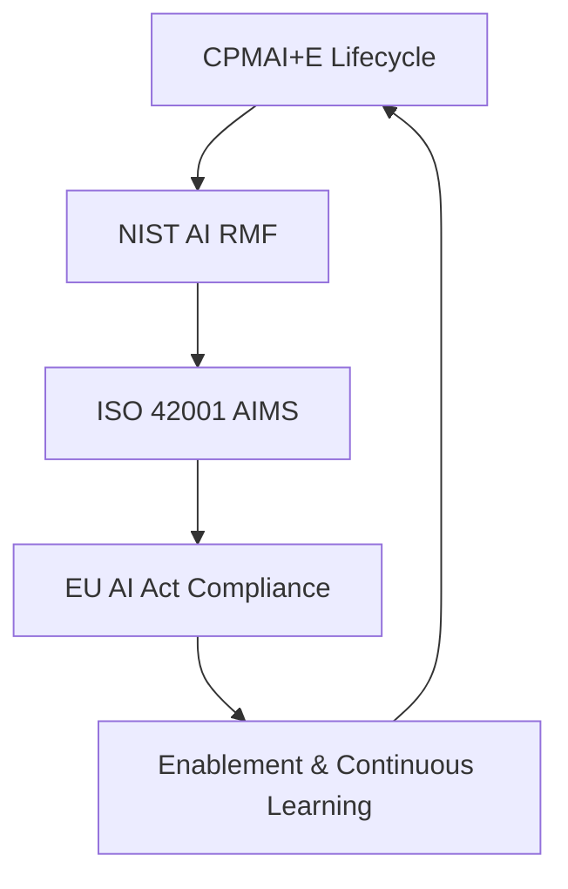

# 🎯 Integrated AI Governance & Project Management System (IAGPM‑GenAI)

> **A complete operational framework for Responsible AI, LLMOps, and AI Transformation**
>
> _Empowering organizations to harness GenAI responsibly through structured frameworks, practical guidance, and proven methodologies._
>
> **Author**: Samuel Prime | 2025 | MIT License

---

## 📑 Table of Contents

- [📘 Overview](#-overview)
- [🎯 What This Handbook Addresses](#-what-this-handbook-addresses)
- [👥 Who This Is For](#-who-this-is-for)
- [🗺️ Repository Navigation](#️-repository-navigation)
- [🧭 Quick Navigation](#-quick-navigation)
- [📚 Handbook Structure](#-handbook-structure)
- [🚀 Getting Started by Role](#-getting-started-by-role)
- [🔧 How to Use This System](#-how-to-use-this-system)
- [⚙️ Adoption & Implementation](#️-adoption--implementation)
- [🧩 Framework Alignment](#-framework-alignment)
- [📄 License & Usage](#-license--usage)
- [🙏 Acknowledgments](#-acknowledgments)
- [❓ FAQ](#-faq)
- [👨‍💼 About the Author](#-about-the-author)

---

## 📘 Overview

This repository serves as a **portfolio and implementation reference** for the Integrated AI Governance & Project Management System (IAGPM‑GenAI). It unifies **project management**, **AI governance**, and **responsible AI operations** into one deployable framework.

### 🔗 Framework Synthesis

The system synthesizes:

- **CPMAI+E** – Cognitive Project Management for AI + Ethical alignment
- **NIST AI RMF** – Risk‑based trustworthy AI management
- **ISO/IEC 42001:2024** – AI Management System (AIMS) standard
- **EU AI Act** – Regulatory compliance framework
- **The Fifth Discipline** – Systems thinking for adaptive learning organizations

### 🎯 Core Philosophy

Use this repo to explore **governed speed**: delivering GenAI safely, efficiently, and in compliance.

> _This repository is both a live portfolio and a deployable Responsible AI operating system. It demonstrates how governance, compliance, and velocity can coexist._

---

## 🎯 What This Handbook Addresses

### The Challenge

Organizations implementing Generative AI face critical gaps:

- **Governance vacuum**: Lack of frameworks for responsible AI deployment
- **Risk uncertainty**: Unknown security, compliance, and ethical implications
- **Practice fragmentation**: Teams reinventing processes without shared standards
- **Knowledge silos**: Expertise scattered across roles without unified guidance

### Our Solution

This handbook provides a comprehensive, actionable framework covering:

- ✅ **Governance structures** for AI oversight and accountability
- ✅ **Risk management** frameworks tailored to GenAI characteristics
- ✅ **Practice guidelines** for development, deployment, and operations
- ✅ **Management strategies** for AI programs and portfolios
- ✅ **Compliance templates** aligned with emerging regulations

### Why This Handbook?

| Benefit | Description |
|---------|-------------|
| 🏛️ **Structured Framework** | Battle-tested methodologies, not theoretical concepts |
| ⚡ **Immediately Actionable** | Templates, checklists, and step-by-step guides |
| 🔄 **Living Document** | Regularly updated with emerging best practices |
| 🌐 **Cross-Functional** | Bridges technical, legal, business, and ethical domains |
| 📊 **Evidence-Based** | Grounded in real-world implementations and case studies |

---

## 👥 Who This Is For

This handbook serves multiple stakeholder groups:

| Role | Primary Needs | Key Sections |
|------|---------------|--------------|
| 🎯 **AI Program Managers** | Strategy, governance, ROI tracking | [Handbook §2.3.5-2.3.6](Handbook.md#235-operationalization--management), [Tutorial](Tutorial.md) |
| 👨‍💼 **Executives & Decision Makers** | Risk overview, compliance, business impact | [Executive Summary](Executive_Summary.md), [Handbook §1](Handbook.md#1--framework-ingestion--mapping) |
| 👨‍💻 **AI/ML Engineers** | Technical standards, deployment practices | [Handbook §2.3.3-2.3.4](Handbook.md#233-data-preparation), [How-To Guides](Howto.md) |
| ⚖️ **Compliance Officers** | Regulatory alignment, audit trails | [Handbook §2.3.1](Handbook.md#231-business-understanding--governing), [Reference §2.1](Reference.md#21-regulations--frameworks-by-industry) |
| 🔒 **Security Teams** | Threat models, security controls | [Handbook §2.3.4](Handbook.md#234-model-development--measurement), [How-To §3](Howto.md#3-deploying-generative-ai-responsibly) |
| 📊 **Product Managers** | Use case evaluation, implementation roadmaps | [Tutorial §2](Tutorial.md#2-step-by-step-implementation), [Quick Start](Quick_Start_Guide.md) |
| 🎓 **AI Ethics Leads** | Responsible AI principles, bias mitigation | [Handbook §2.3.6](Handbook.md#236-cross-cutting-domains), [Explanation](Explanation.md) |

---

## 🗺️ Repository Navigation

### 📄 Core Framework Documents (Root Directory)

| Document | 📖 Description |
|----------|---------------|
| [📋 Executive_Summary.md](./Executive_Summary.md) | Overview of system value, scope, and context |
| [📘 Handbook.md](./Handbook.md) | Comprehensive operating manual for the integrated framework |
| [🎓 Tutorial.md](./Tutorial.md) | Step‑by‑step onboarding and walkthrough examples |
| [🔧 Howto.md](./Howto.md) | Problem‑oriented guides for applying specific components |
| [📚 Reference.md](./Reference.md) | Full component catalog, task tables, and quick‑lookups |
| [⚡ Quick_Start_Guide.md](./Quick_Start_Guide.md) | Rapid setup path to deploy the system in under an hour |
| [💡 Explanation.md](./Explanation.md) | Conceptual rationale and architecture synthesis narrative |

---

### 🧩 Technical

**Operational blueprints and engineering templates**

| File | 📖 Description |
|------|---------------|
| [🏗️ llmops_reference_runbook.md](./Technical/llmops_reference_runbook.md) | End‑to‑end LLMOps architecture + operational SOP |
| [📜 policy_as_code_starter.md](./Technical/policy_as_code_starter.md) | YAML policy rules + evaluation matrix for automated governance |
| [🇪🇺 eu_ai_act_readiness.md](./Technical/eu_ai_act_readiness.md) | Risk‑tier classification & evidence pack preparation |
| [📊 iso_42001_aims_scope_context.md](./Technical/iso_42001_aims_scope_context.md) | Define AIMS scope, context, and stakeholder expectations |
| [🔄 nist_cpmai_crosswalk.md](./Technical/nist_cpmai_crosswalk.md) | NIST AI RMF ↔ CPMAI+E mapping for aligned governance |
| [🃏 model_system_card_templates.md](./Technical/model_system_card_templates.md) | Ready‑to‑use model & system card templates with diagram |
| [📂 README.md](./Technical/README.md) | Local directory index and usage guidance |

---

### 🛡️ Governance & Compliance

**Governance playbooks, risk management, and compliance automation**

| File | 📖 Description |
|------|---------------|
| [🔍 dpia_tra_data_governance_pack.md](./Governance%20%26%20Compliance/dpia_tra_data_governance_pack.md) | Combined DPIA & Technical Risk Assessment workflow |
| [🚨 incident_response_rollback_playbook.md](./Governance%20%26%20Compliance/incident_response_rollback_playbook.md) | Structured plan for incident containment and rollback |
| [🤝 third_party_llm_vendor_due_diligence.md](./Governance%20%26%20Compliance/third_party_llm_vendor_due_diligence.md) | Vendor evaluation checklist for Responsible AI maturity |
| [📊 executive_kpi_dashboard_spec.md](./Governance%20%26%20Compliance/executive_kpi_dashboard_spec.md) | Unified view of performance, risk, and trust metrics |
| [🗺️ eu_ai_act_risk_tier_nist_mapper.md](./Governance%20%26%20Compliance/eu_ai_act_risk_tier_nist_mapper.md) | Dual‑framework mapping for audit alignment |
| [⚖️ balanced_scorecard_responsible_ai.md](./Governance%20%26%20Compliance/balanced_scorecard_responsible_ai.md) | Enterprise KPI framework for Responsible AI adoption |
| [📂 README.md](./Governance%20%26%20Compliance/README.md) | Local directory index and compliance roadmap |

---

### 🧠 Enablement

**Operational guides for adoption, training, and transformation**

| File | 📖 Description |
|------|---------------|
| [📝 case_study_template.md](./Enablement/case_study_template.md) | Structured before/after/control case study format |
| [🚀 push_button_kit_readme.md](./Enablement/push_button_kit_readme.md) | Starter repo for the 30‑Day Governed Speed Kit |
| [🎓 enablement_curriculum.md](./Enablement/enablement_curriculum.md) | Team and executive learning modules & certification path |
| [📅 governed_speed_30_day_plan.md](./Enablement/governed_speed_30_day_plan.md) | 30‑day rollout plan for Responsible AI governance |
| [📂 README.md](./Enablement/README.md) | Local directory index and enablement overview |

---

## 🧭 Quick Navigation

### ⏱️ By Time Available

- **5 minutes**: Read [📋 Executive Summary](Executive_Summary.md) for high-level overview
- **30 minutes**: Review [⚡ Quick Start Guide](Quick_Start_Guide.md) + your role-specific section
- **2 hours**: Deep dive into [📘 Handbook §2.2-2.3](Handbook.md#22-roles--accountability) (Governance Framework and Risk Management)
- **Full handbook**: ~8-10 hours of comprehensive reading

### 🎯 By Information Need

- 🚀 **Getting Started**: [Executive Summary](Executive_Summary.md) → [Quick Start Guide](Quick_Start_Guide.md) → [Tutorial §1](Tutorial.md#1-quickstart-overview)
- 📐 **Setting Up Governance**: [Handbook §2.2](Handbook.md#22-roles--accountability) → [Handbook §2.4](Handbook.md#24-templates--samples) → [Quick Start Week 1](Quick_Start_Guide.md#week-1-foundation-days-1-7)
- ⚠️ **Managing Risks**: [Reference §2.4](Reference.md#24-risk-scoring) → [Handbook §2.4.2](Handbook.md#242-risk-management-table) → [How-To §2](Howto.md#2-managing-high-risk-ai-in-finance)
- 🛠️ **Implementing Practices**: [Tutorial §2.4-2.7](Tutorial.md#24-prepare-data) → [How-To §3](Howto.md#3-deploying-generative-ai-responsibly) → [Reference §1](Reference.md#1-component-catalog)
- 📏 **Ensuring Compliance**: [Reference §2.1](Reference.md#21-regulations--frameworks-by-industry) → [Handbook §2.3.1](Handbook.md#231-business-understanding--governing) → [How-To §4](Howto.md#4-aligning-with-federal-contracting-requirements)

### 🌟 Most Accessed Sections

1. 📊 [Risk Assessment Template](Handbook.md#242-risk-management-table)
2. 🏛️ [Governance Committee Roles](Handbook.md#22-roles--accountability)
3. 🔒 [Data Governance Guidelines](Handbook.md#236-cross-cutting-domains)
4. ✅ [EU AI Act Classification](Handbook.md#1--framework-ingestion--mapping)
5. 🚨 [Incident Response Procedures](Handbook.md#235-operationalization--management)

---

## � How to Use This System

### 📖 Recommended Learning Path

1. **Start with** the [📋 Executive_Summary.md](./Executive_Summary.md) and [⚡ Quick_Start_Guide.md](./Quick_Start_Guide.md)
2. **Build technical fluency** using the [🧩 Technical](./Technical) folder
3. **Implement governance** with the [🛡️ Governance & Compliance](./Governance%20%26%20Compliance) resources
4. **Enable adoption** using [🧠 Enablement](./Enablement) materials
5. **Demonstrate results** with real or simulated case studies

### 🎯 By Use Case

- **Launching a new AI initiative**: Quick Start → Governance Setup → Risk Assessment
- **Achieving compliance**: Regulatory Reference → Policy Templates → Audit Checklist
- **Building technical capability**: LLMOps Runbook → Model Cards → Deployment Guides
- **Training your team**: Enablement Curriculum → Case Studies → Hands-on Tutorial

---

## 📚 Handbook Structure

### 📖 Part 1: Foundations (Chapters 1-3)

**What**: Core concepts, principles, and framework overview
**Who**: All audiences—essential baseline knowledge
**Time**: ~2 hours

- **Ch 1: [Framework Integration](Handbook.md#1--framework-ingestion--mapping)** - Why governance matters, key frameworks synthesized
- **Ch 2: [Unified Operational System](Handbook.md#2--unified-operational-handbook)** - The IAGPM methodology architecture
- **Ch 3: [Implementation Roadmap](Handbook.md#3--implementation-roadmap)** - Practical adoption phases

### 🏛️ Part 2: Governance (Chapters 4-7)

**What**: Organizational structures, policies, and decision-making frameworks
**Who**: Executives, program managers, compliance officers
**Time**: ~3 hours

- **Ch 4: [Roles & Accountability](Handbook.md#22-roles--accountability)** - Committee structures, responsibilities
- **Ch 5: [Business Understanding](Handbook.md#231-business-understanding--governing)** - Context analysis, ethical principles
- **Ch 6: [Data Understanding & Mapping](Handbook.md#232-data-understanding--mapping)** - Stakeholder mapping, risk identification
- **Ch 7: [Cross-Cutting Functions](Handbook.md#236-cross-cutting-domains)** - Data governance, trustworthy AI

### ⚠️ Part 3: Risk Management (Chapters 8-11)

**What**: Identifying, assessing, and mitigating GenAI-specific risks
**Who**: Security teams, compliance officers, risk managers
**Time**: ~2.5 hours

- **Ch 8: [Risk Framework](Reference.md#24-risk-scoring)** - Taxonomy of GenAI risks (security, ethical, operational)
- **Ch 9: [How-To: High-Risk AI](Howto.md#2-managing-high-risk-ai-in-finance)** - Industry-specific risk management
- **Ch 10: [Risk Templates](Handbook.md#242-risk-management-table)** - Risk registers and mitigation strategies
- **Ch 11: [Incident Management](Handbook.md#235-operationalization--management)** - Response protocols, lessons learned

### 🛠️ Part 4: Practices (Chapters 12-16)

**What**: Day-to-day operational guidance for AI teams
**Who**: Engineers, product managers, data scientists
**Time**: ~4 hours

- **Ch 12: [Development Lifecycle](Tutorial.md#2-step-by-step-implementation)** - From ideation to deployment
- **Ch 13: [Data Preparation](Handbook.md#233-data-preparation)** - Cleaning, augmentation, privacy
- **Ch 14: [Model Development](Handbook.md#234-model-development--measurement)** - Selection, training, evaluation
- **Ch 15: [Testing & Assurance](Tutorial.md#26-evaluate--decide)** - Go/no-go reviews, safety testing
- **Ch 16: [Operationalization](Handbook.md#235-operationalization--management)** - Deployment, monitoring, maintenance

### 📊 Part 5: Management (Chapters 17-20)

**What**: Strategic program management and continuous improvement
**Who**: Program managers, executives, product leaders
**Time**: ~2.5 hours

- **Ch 17: [Quick Start Guide](Quick_Start_Guide.md)** - 30-day governance launch
- **Ch 18: [Customization Guidance](Quick_Start_Guide.md#common-pitfalls-and-solutions)** - Adapting for org size and industry
- **Ch 19: [Success Metrics](Quick_Start_Guide.md#success-metrics)** - Measuring governance effectiveness
- **Ch 20: [Continuous Improvement](Handbook.md#236-cross-cutting-domains)** - Learning and evolution

### 📑 Appendices

- **A: [Templates & Checklists](Handbook.md#24-templates--samples)** - Ready-to-use artifacts
- **B: [Tutorial & Case Studies](Tutorial.md#3-example-project-automating-clinical-trial-summaries)** - Real-world implementation examples
- **C: [Regulatory Reference](Reference.md#21-regulations--frameworks-by-industry)** - EU AI Act, GDPR, sector-specific rules
- **D: [Component Catalog](Reference.md#1-component-catalog)** - Quick-lookup tables and mappings
- **E: [Conceptual Architecture](Explanation.md)** - Design decisions and trade-offs

---

## 🚀 Getting Started by Role

<strong>🏢 For Executives & Decision Makers</strong>

### Your Priority Path

1. **Start here**: [Executive Summary](Executive_Summary.md) - 10 min
2. **Understand risks**: [Executive Summary §The Challenge](Executive_Summary.md#the-business-case-for-ai-governance) - 15 min
3. **See the framework**: [Handbook §2.2](Handbook.md#22-roles--accountability) - 30 min
4. **Review implementation**: [Executive Summary §Strategic Implementation](Executive_Summary.md#strategic-implementation-approach) - 20 min

### Key Questions This Handbook Answers

- ✅ What governance structure do we need? → [Handbook §2.2](Handbook.md#22-roles--accountability)
- ✅ What are our biggest GenAI risks and how do we mitigate them? → [Reference §2.4](Reference.md#24-risk-scoring)
- ✅ What compliance obligations apply to our industry? → [Reference §2.1](Reference.md#21-regulations--frameworks-by-industry)
- ✅ How do we measure ROI and success? → [Executive Summary §ROI](Executive_Summary.md#return-on-investment)
- ✅ What resources are required for responsible implementation? → [Quick Start Guide](Quick_Start_Guide.md#prerequisites)

### Next Steps

1. Assess your organization's AI maturity → [Quick Start Day 3-5](Quick_Start_Guide.md#day-3-5-conduct-readiness-assessment)
2. Identify governance gaps using the readiness checklist → [Handbook §2.4.1](Handbook.md#241-readiness-assessment-questions-03-scale)
3. Draft initial governance charter → [Quick Start Week 1](Quick_Start_Guide.md#week-1-foundation-days-1-7)
4. Schedule stakeholder alignment workshop → [Quick Start Day 1-2](Quick_Start_Guide.md#day-1-2-form-governance-team)

### Success Indicators

- [ ] Can articulate your organization's AI governance philosophy
- [ ] Have identified executive sponsor and oversight committee
- [ ] Understand top 3 risks specific to your use cases
- [ ] Have roadmap for phased governance implementation

<strong>🎯 For AI Program Managers</strong>

### Your Priority Path

1. **Framework foundations**: [Handbook §1-2](Handbook.md#1--framework-ingestion--mapping) - 90 min
2. **Governance setup**: [Handbook §2.2-2.3.1](Handbook.md#22-roles--accountability) - 2.5 hours
3. **Program management**: [Tutorial §2](Tutorial.md#2-step-by-step-implementation) - 2 hours
4. **Templates dive**: [Handbook §2.4](Handbook.md#24-templates--samples) - 1 hour

### Key Questions This Handbook Answers

- ✅ How do I structure an AI governance program from scratch? → [Quick Start Guide](Quick_Start_Guide.md)
- ✅ What policies and procedures are non-negotiable? → [Handbook §2.3.1](Handbook.md#231-business-understanding--governing)
- ✅ How do I balance innovation speed with risk management? → [How-To §5](Howto.md#5-troubleshooting-integration-conflicts)
- ✅ What metrics prove program effectiveness? → [Quick Start §Success Metrics](Quick_Start_Guide.md#success-metrics)
- ✅ How do I get cross-functional buy-in? → [Quick Start Day 1-2](Quick_Start_Guide.md#day-1-2-form-governance-team)

### Recommended Use

- Week 1: Read foundation chapters, complete [maturity assessment](Quick_Start_Guide.md#day-3-5-conduct-readiness-assessment)
- Week 2-3: Customize [governance templates](Handbook.md#24-templates--samples) for your context
- Week 4: Facilitate stakeholder workshops using [Quick Start guidance](Quick_Start_Guide.md#day-13-14-map-stakeholders-and-context)
- Ongoing: Use as reference when new use cases or risks emerge

### Success Indicators

- [ ] Have documented governance framework adopted by leadership
- [ ] Established regular cadence for oversight committee
- [ ] Created intake process for new AI use cases → [Handbook §2.4.4](Handbook.md#244-intake-process-steps)
- [ ] Deployed initial set of policies and guardrails
- [ ] Built relationships across key stakeholder groups

<strong>👨‍💻 For AI/ML Engineers & Developers</strong>

### Your Priority Path

1. **Context setting**: [Handbook §1](Handbook.md#1--framework-ingestion--mapping) (skim) - 30 min
2. **Technical practices**: [Tutorial §2.4-2.7](Tutorial.md#24-prepare-data) - 3 hours
3. **Development standards**: [Handbook §2.3.3-2.3.4](Handbook.md#233-data-preparation) - 45 min
4. **Deployment guide**: [How-To §3](Howto.md#3-deploying-generative-ai-responsibly) - 30 min

### Key Questions This Handbook Answers

- ✅ What are the mandatory checkpoints in the development lifecycle? → [Tutorial §2.5](Tutorial.md#25-develop--measure-models)
- ✅ How do I implement responsible AI principles in code? → [Handbook §2.3.6](Handbook.md#236-cross-cutting-domains)
- ✅ What security controls are required for GenAI systems? → [How-To §3](Howto.md#3-deploying-generative-ai-responsibly)
- ✅ How do I document models for compliance and auditability? → [Handbook §2.3.4](Handbook.md#234-model-development--measurement)
- ✅ What monitoring is needed post-deployment? → [Handbook §2.4.5](Handbook.md#245-monitoring-plan)

### Practical Takeaways

- Development checklists for each lifecycle phase → [Handbook §2.3.3](Handbook.md#checklist-data-preparation)
- Data preparation best practices → [Tutorial §2.4](Tutorial.md#24-prepare-data)
- Model documentation templates → [Handbook §2.3.4](Handbook.md#234-model-development--measurement)
- Testing protocols for bias and safety → [Tutorial §2.5](Tutorial.md#25-develop--measure-models)
- Deployment configuration guide → [Tutorial §2.7](Tutorial.md#27-operationalize--monitor)

### Success Indicators

- [ ] Can explain governance requirements to teammates
- [ ] Integrated required checkpoints into development workflow
- [ ] Implemented logging and monitoring per guidelines
- [ ] Completed model documentation for your projects
- [ ] Know escalation path when issues arise

<strong>⚖️ For Compliance & Legal Teams</strong>

### Your Priority Path

1. **Regulatory landscape**: [Reference §2.1](Reference.md#21-regulations--frameworks-by-industry) - 1 hour
2. **Policy framework**: [Handbook §2.3.1](Handbook.md#231-business-understanding--governing) - 2 hours
3. **Risk & controls**: [Reference §2.4](Reference.md#24-risk-scoring) - 2 hours
4. **Audit procedures**: [Quick Start Week 3](Quick_Start_Guide.md#week-3-policy-development-days-15-21) - 1 hour

### Key Questions This Handbook Answers

- ✅ What regulations apply to our GenAI use cases? → [Reference §2.1](Reference.md#21-regulations--frameworks-by-industry)
- ✅ How do we create compliant AI usage policies? → [Quick Start Day 15-18](Quick_Start_Guide.md#day-15-18-draft-core-policies)
- ✅ What records and documentation are required? → [Handbook §2.3.4](Handbook.md#234-model-development--measurement)
- ✅ How do we audit AI systems effectively? → [Quick Start Day 19-21](Quick_Start_Guide.md#day-19-21-legal-and-compliance-review)
- ✅ What contractual considerations exist for third-party models? → [How-To §4](Howto.md#4-aligning-with-federal-contracting-requirements)

### Compliance Toolkit

- Policy template library → [Quick Start Day 15-18](Quick_Start_Guide.md#day-15-18-draft-core-policies)
- Regulatory compliance matrix → [Reference §2.1](Reference.md#21-regulations--frameworks-by-industry)
- Risk assessment questionnaire → [Handbook §2.4.1](Handbook.md#241-readiness-assessment-questions-03-scale)
- Audit checklist and procedures → [Quick Start Day 19-21](Quick_Start_Guide.md#day-19-21-legal-and-compliance-review)
- Vendor assessment criteria → [Handbook §2.3.2](Handbook.md#232-data-understanding--mapping)

### Success Indicators

- [ ] Have mapped applicable regulations to your use cases
- [ ] Created compliant policies approved by legal counsel
- [ ] Established audit trail and documentation requirements
- [ ] Trained stakeholders on compliance obligations
- [ ] Can demonstrate compliance in regulatory inquiry

<strong>🔒 For Security Teams</strong>

### Your Priority Path

1. **Threat landscape**: [How-To §3](Howto.md#3-deploying-generative-ai-responsibly) - 1 hour
2. **Security controls**: [Handbook §2.3.6](Handbook.md#236-cross-cutting-domains) - 1.5 hours
3. **Incident response**: [Handbook §2.3.5](Handbook.md#235-operationalization--management) - 1 hour
4. **Data governance**: [Handbook §2.3.2-2.3.3](Handbook.md#232-data-understanding--mapping) - 1 hour

### Key Questions This Handbook Answers

- ✅ What are GenAI-specific security threats? → [How-To §3](Howto.md#3-deploying-generative-ai-responsibly)
- ✅ How do we prevent prompt injection, data poisoning, and model theft? → [Handbook §2.3.6](Handbook.md#236-cross-cutting-domains)
- ✅ What security controls are recommended vs. required? → [Reference §2.4](Reference.md#24-risk-scoring)
- ✅ How do we respond to AI security incidents? → [Handbook §2.3.5](Handbook.md#235-operationalization--management)
- ✅ How do we secure training data and model artifacts? → [Handbook §2.3.3](Handbook.md#233-data-preparation)

### Security Arsenal

- GenAI threat model → [How-To §3](Howto.md#3-deploying-generative-ai-responsibly)
- Control mapping to NIST AI RMF → [Reference §2.2](Reference.md#22-mapping-cpmai-phases-to-ai-rmf-functions)
- Incident response playbook → [Handbook §2.3.5](Handbook.md#235-operationalization--management)
- Data security guidelines → [Handbook §2.3.3](Handbook.md#233-data-preparation)
- Secure deployment checklist → [Tutorial §2.7](Tutorial.md#27-operationalize--monitor)

### Success Indicators

- [ ] Integrated GenAI risks into threat model
- [ ] Deployed recommended security controls
- [ ] Established incident response procedures
- [ ] Conducted security assessment on AI systems
- [ ] Secured training data and model pipelines

---

## ⚙️ Adoption & Implementation

### 🎬 Phase 1: Foundation (Weeks 1-4)

**Goal**: Establish baseline understanding and leadership buy-in

- [ ] **Week 1**: Leadership reads Executive Summary, conducts maturity assessment
- [ ] **Week 2**: Form steering committee, assign roles per Ch 4
- [ ] **Week 3**: Stakeholder workshops using Ch 7 facilitation guide
- [ ] **Week 4**: Draft initial governance charter and get executive approval

**Deliverables**: Governance charter, committee roster, stakeholder map

### 📝 Phase 2: Policy Development (Weeks 5-10)

**Goal**: Create core policies and procedures

- [ ] **Weeks 5-6**: Customize policy templates (Appendix A.3-A.6) for your context
- [ ] **Weeks 7-8**: Legal/compliance review and refinement
- [ ] **Weeks 9-10**: Socialize policies, conduct training sessions

**Deliverables**: Approved AI usage policies, acceptable use guidelines, data handling procedures

### 🚀 Phase 3: Implementation (Weeks 11-16)

**Goal**: Deploy governance mechanisms and controls

- [ ] **Weeks 11-12**: Establish use case intake and approval process (Ch 5.2)
- [ ] **Weeks 13-14**: Implement technical controls and monitoring (Ch 10, 16)
- [ ] **Weeks 15-16**: Pilot governance process with 2-3 use cases

**Deliverables**: Operational intake process, deployed controls, pilot learnings

### 📈 Phase 4: Operationalization (Weeks 17-24)

**Goal**: Scale governance across organization

- [ ] **Weeks 17-20**: Roll out to additional teams, refine based on feedback
- [ ] **Weeks 21-22**: Establish metrics and reporting dashboard (Ch 19)
- [ ] **Weeks 23-24**: First governance review and continuous improvement cycle

**Deliverables**: Scaled governance program, metrics dashboard, improvement backlog

### 🎯 Customization Guidance

#### 🏢 For Small Organizations (&lt;100 employees)

- **Streamline governance**: Single AI lead vs. full committee (see Ch 4.5)
- **Lightweight policies**: Use starter templates (Appendix A.3.1)
- **Focus on high-risk use cases**: Prioritize customer-facing and sensitive data scenarios
- **Leverage third-party tools**: Adopt vendor solutions where possible

#### 🏭 For Enterprise Organizations (&gt;1000 employees)

- **Federated governance**: Hub-and-spoke model (Ch 4.3)
- **Comprehensive policies**: Full policy suite with role-based variations
- **Dedicated resources**: AI governance team, tools, and budget
- **Integration with existing frameworks**: Align with IT governance, risk management, compliance programs

#### 🏥 For Regulated Industries (Finance, Healthcare, Government)

- **Heightened rigor**: Start with strictest controls, relax as appropriate
- **Sector-specific guidance**: See regulatory appendix for industry considerations
- **Documentation emphasis**: Enhanced record-keeping and audit trails
- **Regular external review**: Engage auditors and regulators early

### ⚠️ Common Pitfalls to Avoid

| ❌ Pitfall | ✅ Better Approach |
|-----------|-------------------|
| Governance as gate-keeping | Governance as enablement—streamline approvals for low-risk cases |
| Policies written in isolation | Co-create with stakeholders, pilot with real use cases |
| Treating handbook as one-time read | Embed into onboarding, reference in workflows, update regularly |
| Copying policies verbatim | Customize templates to your risk appetite and culture |
| Over-indexing on perfection | Start with minimum viable governance, iterate based on learnings |
| Ignoring enforcement | Establish accountability, consequences, and regular audits |

---

## 🧩 Framework Alignment

### 🔄 Integration Architecture

This framework integrates multiple industry-leading standards and methodologies into a cohesive system:

### 📊 Framework Components

| Framework | Purpose | Key Contribution |
|-----------|---------|------------------|
| 🔄 **CPMAI+E** | Project methodology for AI initiatives | Lifecycle phases, task structure, ethical integration |
| 🛡️ **NIST AI RMF** | Risk management framework | Govern, Map, Measure, Manage functions |
| ⚖️ **ISO 42001:2024** | AI Management System standard | Organizational governance, processes, controls |
| 🇪🇺 **EU AI Act** | Regulatory compliance | Risk classification, prohibited practices, conformity |
| 🌀 **Fifth Discipline** | Learning organization principles | Systems thinking, continuous improvement |

### 🎯 Unified Value Proposition

- **For Practitioners**: End-to-end operational playbook from ideation to monitoring
- **For Executives**: Risk-aware governance with measurable business outcomes
- **For Regulators**: Demonstrable compliance with audit trails
- **For Organizations**: Velocity without sacrificing responsibility

---

## 📄 License & Usage

### 📜 License

MIT License

Copyright (c) 2025 Samuel Prime

Permission is hereby granted, free of charge, to any person obtaining a copy
of this handbook and associated documentation files (the "Handbook"), to deal
in the Handbook without restriction, including without limitation the rights
to use, copy, modify, merge, publish, distribute, sublicense, and/or sell
copies of the Handbook, and to permit persons to whom the Handbook is
furnished to do so, subject to the following conditions:

The above copyright notice and this permission notice shall be included in all copies or substantial portions of the Handbook.

THE HANDBOOK IS PROVIDED "AS IS", WITHOUT WARRANTY OF ANY KIND, EXPRESS OR
IMPLIED, INCLUDING BUT NOT LIMITED TO THE WARRANTIES OF MERCHANTABILITY,
FITNESS FOR A PARTICULAR PURPOSE AND NONINFRINGEMENT. IN NO EVENT SHALL THE
AUTHORS OR COPYRIGHT HOLDERS BE LIABLE FOR ANY CLAIM, DAMAGES OR OTHER
LIABILITY, WHETHER IN AN ACTION OF CONTRACT, TORT OR OTHERWISE, ARISING FROM,
OUT OF OR IN CONNECTION WITH THE HANDBOOK OR THE USE OR OTHER DEALINGS IN THE
HANDBOOK.

**You are free to**:

- ✅ Share: Copy and redistribute in any medium or format
- ✅ Adapt: Remix, transform, and build upon the material for any purpose

**Under the following terms**:

- 📝 Attribution: Give appropriate credit, provide link to license
- 🔄 ShareAlike: Distribute adaptations under the same license
- 🚫 No additional restrictions: Cannot apply legal terms or technological measures that restrict others

### 📝 Attribution

When using this handbook, please cite as:

> IAGPM GenAI Handbook (v1.0.0). Retrieved from <https://github.com/SPRIME01/iagpm-genai>

### 💼 Commercial Use

Organizations may use this handbook internally and with clients. We encourage sharing improvements back to the community but do not require it for internal customizations.

---

## 🙏 Acknowledgments

### 👥 Contributors

This handbook reflects the collective wisdom of:

- **Governance practitioners** across industries who shared frameworks and learnings
- **AI researchers** who provided technical guidance and risk insights
- **Legal and compliance experts** who ensured regulatory accuracy
- **Early adopters** who piloted these practices and provided feedback

### 📚 Inspiration & References

- NIST AI Risk Management Framework
- EU AI Act guidance and implementing regulations
- OECD AI Principles
- Partnership on AI resources
- Industry-specific frameworks (FDA AI/ML guidance, FS-ISAC AI working group)

---

## ❓ FAQ

<strong>Is this handbook applicable to all AI, or just GenAI?</strong>

Primarily **Generative AI** (LLMs, image generation, etc.). While many principles apply broadly, risk profiles and practices differ for other AI types (e.g., traditional ML, computer vision). We focus on GenAI's unique characteristics: creativity, unpredictability, potential for misuse.

<strong>Do I need to read cover-to-cover, or can I jump to relevant sections?</strong>

**Modular design intended**. After reading Chapters 1-3 for foundations, navigate directly to your role-specific sections. Cross-references guide you to related content as needed.

<strong>Can I customize templates and policies for my organization?</strong>

**Absolutely**. Templates are starting points—adapt to your context, risk appetite, and culture. We encourage sharing generic versions of improvements back to the community.

<strong>Is this handbook compliant with [specific regulation]?</strong>

We provide **guidance aligned with major frameworks** (EU AI Act, NIST AI RMF, etc.), but **cannot guarantee compliance** for any specific jurisdiction or use case. Consult legal counsel to ensure your implementation meets applicable requirements.

---

## 👨‍💼 About the Author

**Samuel Prime** — AI Governance, Transformation & LLMOps Leader

I design frameworks that make AI **trustworthy, compliant, and high‑velocity.**

### 🎯 Expertise Areas

- 🛡️ Responsible AI Governance
- 🔧 LLMOps & AI Operations
- ⚖️ ISO 42001 & AI Management Systems
- 🇪🇺 EU AI Act Compliance
- 📊 AI Risk Management & Assessment
- 🤖 Governance Automation

### 📬 Contact

- 🌐 [LinkedIn](https://www.linkedin.com/in/iamsamprime/)
- 📍 **Location**: Research Triangle Park (RTP), North Carolina / Remote

---

## 🚀 Ready to Get Started?

**Quick Links:**

- 📋 Start with [Executive Summary](Executive_Summary.md)
- ⚡ Jump into [Quick Start Guide](Quick_Start_Guide.md)
- 💬 Questions? Visit [GitHub Discussions](https://github.com/SPRIME01/IAGPM-GenAI-Handbook/discussions)

> _This repository is both a live portfolio and a deployable Responsible AI operating system. It demonstrates how governance, compliance, and velocity can coexist._

---

**Last Updated**: October 28, 2025 | **Version**: 1.0.0 | **License**: MIT
