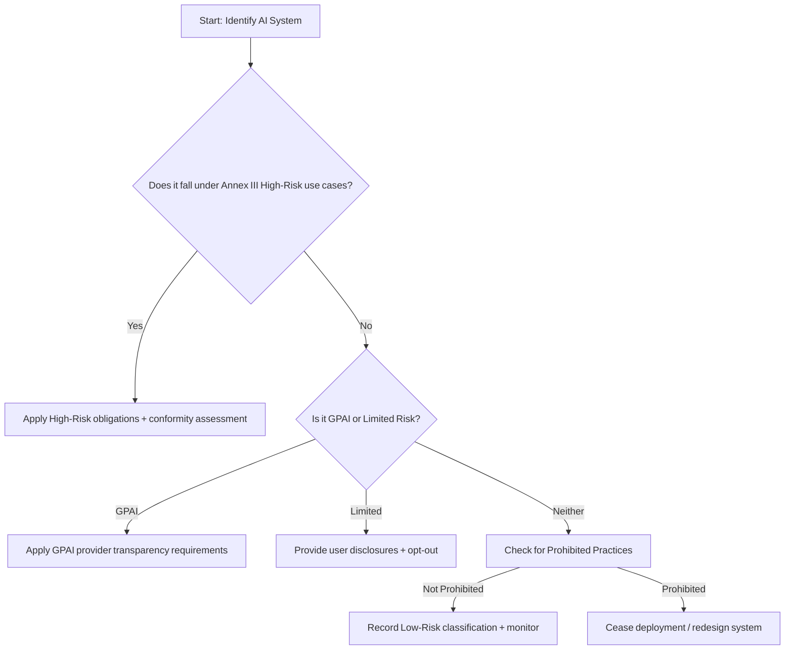

# EU AI Act Readiness Checklist (Condensed)

## 1. Purpose
Provide a structured readiness assessment for AI systems to align with the EU Artificial Intelligence Act (EU AI Act) obligations.

---

## 2. Step 1 – Classification
| Question | Response | Notes |
|-----------|-----------|-------|
| System type (GPAI / High / Limited / Prohibited) |  |  |
| Intended purpose and domain |  |  |
| User type & competence expectations |  |  |
| Autonomy level (human‑in‑loop, on‑loop, off‑loop) |  |  |
| Impact scope & stakeholders |  |  |

---

## 3. Step 2 – High‑Risk Obligations
| Obligation | Evidence Required | Status |
|-------------|------------------|---------|
| Risk management system | Risk register, controls plan |  |
| Data & data governance | Data lineage & quality docs |  |
| Technical documentation | Model card / System card |  |
| Record‑keeping | Logging policy & retention |  |
| Transparency & user info | Disclosure notice / UI elements |  |
| Human oversight | SOPs & training records |  |
| Accuracy / robustness / cybersecurity | Eval pack / pen‑test results |  |
| Post‑market monitoring plan | Monitoring SOP + incident form |  |
| Incident reporting procedure | Communication protocol |  |
| Conformity assessment path | Internal / Third‑party audit plan |  |

---

## 4. Step 3 – Evidence Pack Index
- Risk management plan + register
- Data governance policy + lineage diagram
- Model & System Cards
- Evaluation results (Quality, Fairness, Safety)
- Transparency statement / user notices
- Human oversight training materials
- Monitoring dashboard screenshots
- Incident forms + RCA reports

---

## 5. Step 4 – Audit Preparation
| Activity | Owner | Frequency |
|-----------|--------|------------|
| Internal self‑assessment review | Governance Lead | Quarterly |
| External audit engagement | Compliance Officer | Annual / as required |
| Evidence archive refresh | Risk Manager | Continuous / quarterly |

---

## 6. Step 5 – Risk Tier Decision Tree

---

## 7. Step 6 – Ongoing Compliance Tasks
| Frequency | Task |
|------------|------|
| Monthly | Update risk register & evidence logs |
| Quarterly | Re‑evaluate classification post changes |
| Bi‑annual | Refresh training on EU AI Act updates |
| Continuous | Monitor for incidents / drift / non‑conformities |

---

## 8. Success Indicators
- System has clear classification + risk tier.  
- Evidence pack complete and up‑to‑date.  
- Post‑market monitoring running continuously.  
- Audit ready with traceability to EU AI Act articles.
