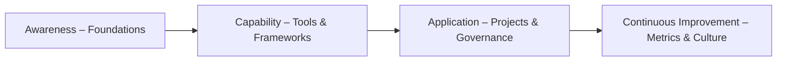

# Enablement Curriculum (Teams & Executives)

## 1. Objective
Build organizational competence in Responsible AI, LLMOps, and Governed Speed delivery using structured learning modules.

---

## 2. Curriculum Overview
| Module | Audience | Duration | Learning Outcome |
|---------|-----------|-----------|------------------|
| **1. Responsible AI Foundations** | All staff | 2 h | Understand principles, laws, and ethics of AI use |
| **2. AI Governance & Compliance Frameworks** | Executives & Governance teams | 2 h | Map NIST AI RMF, ISO 42001, EU AI Act obligations to roles |
| **3. LLMOps Lifecycle & Policy-as-Code** | Engineers / Data Science | 3 h | Apply runbook + policy controls to model pipelines |
| **4. AI Risk Management & Incident Response** | Risk & Compliance | 2 h | Execute TRA/DPIA + Incident Playbook |
| **5. Metrics & Dashboards for Executives** | C-suite / PMO | 1 h | Interpret Responsible AI KPI dashboard for decision making |
| **6. Culture & Change Enablement** | All | 2 h | Embed AI ethics in daily work + PDCA mindset |

---

## 3. Learning Flow

---

## 4. Delivery Modes
| Mode | Format | Tools |
|------|---------|-------|
| Self-paced | eLearning modules | LMS / SCORM / SharePoint Site |
| Live Workshop | 2-hour interactive sessions | Teams / Zoom + Miro boards |
| Simulation | Hands-on incident & policy exercise | Sandbox LLMOps kit |
| Coaching | 1:1 or small group mentoring | Governance Leads |

---

## 5. Certification Path
| Level | Requirement | Credential Issued |
|--------|--------------|------------------|
| **Level 1 – Aware** | Complete Modules 1–2 | Responsible AI Awareness Badge |
| **Level 2 – Practitioner** | Modules 1–4 + case submission | Responsible AI Practitioner Certificate |
| **Level 3 – Leader** | All modules + capstone project | Responsible AI Leader Credential |

---

## 6. Capstone Project
Participants apply frameworks to a real AI use case and submit a mini case study (Before → After → Controls).  
Evaluation criteria: governance design, risk mitigation, and measured impact.

---

## 7. Success Indicators
- ≥ 90 % completion rate for core modules.  
- ≥ 80 % of participants certified Level 2 or above.  
- Documented evidence of AI ethics integration in OKRs or project plans.