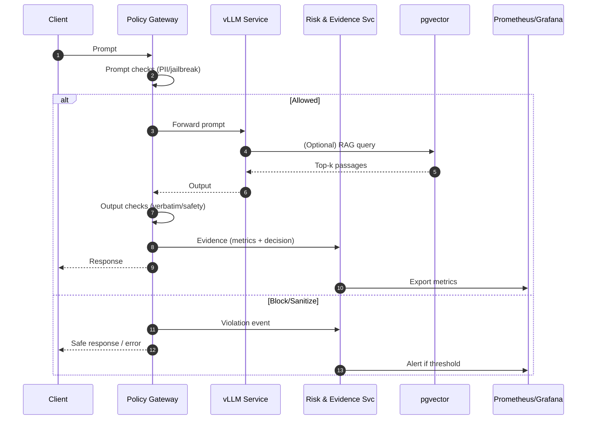

Here’s your **updated Software Design Specification (SDS)** — revised to embody **ADR-006: Embedded AI Governance Integration (EGA)** and the updated PRD. It’s production-ready for human reviewers and directly usable by AI coding agents (clear module boundaries, API contracts, and config hooks).

---

# 📑 Software Design Specification (SDS): Governed-Speed LLMOps Pipeline

**Version:** 1.1  **Date:** 2025-11-05  **Prepared by:** Samuel Prime

> **Key Takeaway:**
> This SDS specifies a modular, scalable, and **governance-embedded** LLMOps pipeline on Kubernetes (k3s) with GitOps (Argo CD), vLLM, pgvector, and a **Policy-as-Code** layer. Every design element maps to **PRD-001…006** and **ADR-001…006**, enabling **continuous compliance**, **self-auditing**, and **governed speed**.

---

# 1. Introduction

### 1.1 Purpose

Provide an implementation-ready technical design for a **hybrid/local-to-cloud** GenAI platform that integrates **delivery and governance inside the same pipeline** (per ADR-006). The system supports automated deployment, scalable LLM inference, semantic retrieval, continuous risk monitoring, and evidence generation.

### 1.2 Scope

Covers components, interfaces, data contracts, security, error handling, testing, SLOs/SLA, and **governance automation** (policy gates, evidence services, dashboards) for MVP per PRD-001…006.

### 1.3 References

* **PRD v1.1** (Governed-Speed updates applied)
* **ADRs:** ADR-001..005 (infra & services), **ADR-006 (Embedded Governance)**
* IEEE 1016-2009 (Software Design Description)
* Repo artifacts (root `README.md`, `/Technical`, `/Governance & Compliance`, `/Enablement`)
* Machine-readable config: `adr-006.embedded-governance.yaml|json`

---

# 2. System Overview

| Architecture Pattern | Microservices on Kubernetes (k3s) with GitOps and governance embedded in CI/CD                    |
| -------------------- | ------------------------------------------------------------------------------------------------- |
| Key Components       | k3s, Argo CD, **Policy Gateway**, **Risk & Evidence Service**, vLLM, pgvector, Prometheus/Grafana |
| Integration Points   | GitHub (CI/CD), S3 (artifacts), PostgreSQL (pgvector), Alertmanager (incidents)                   |

**Addresses PRD:** PRD-001..006 (incl. new PRD-001 Embedded Governance Architecture)

---

# 3. High-Level Architecture

```mermaid
flowchart TD
  subgraph Dev[Source of Truth]
    A[GitHub Repo]:::code --> A1[PRD/ADR/SDS + adr-006 YAML/JSON]:::doc
  end

  A --> B[CI Pipeline]
  B --> C[Policy Gate (PAC)]:::gov
  C -->|pass| D[Argo CD (GitOps Sync)]:::ops
  C -->|fail| C1[Block + Ticket + Evidence]:::gov

  D --> E[k3s Cluster]:::k8s

  subgraph Runtime[k3s Runtime]
    E1[vLLM Inference]:::svc
    E2[Policy Gateway (sidecar/proxy)]:::gov
    E3[pgvector DB]:::data
    E4[Risk & Evidence Service]:::gov
    E5[Prometheus Exporters]:::obs
  end

  E --> E1
  E1 <-->|pre/post filters| E2
  E1 --> E3
  E1 --> E5
  E2 --> E4
  E3 --> E5
  E4 --> E5
  E5 --> G[Grafana Dashboards]:::obs
  E4 --> H[Incident Workflow (Alertmanager->Ticket)]:::ops

classDef gov fill:#1f7a8c,stroke:#0e4a5a,color:#fff;
classDef ops fill:#2a9d8f,stroke:#1f6f69,color:#fff;
classDef k8s fill:#264653,stroke:#1d2f36,color:#fff;
classDef svc fill:#457b9d,stroke:#2e5a75,color:#fff;
classDef data fill:#6a4c93,stroke:#4c3569,color:#fff;
classDef obs fill:#8a5,stroke:#4a7,color:#062;
classDef doc fill:#b07a2f,stroke:#7b541f,color:#fff;
classDef code fill:#b56576,stroke:#8c4352,color:#fff;
```

**Design intent:** Governance checks (quality/fairness/safety/privacy) run **in CI** and **at runtime** (sidecar proxy). Evidence, risk posture, and incidents are **automatic outputs** of the pipeline.

---

# 4. Component Design Specifications

---

## SDS-001: Kubernetes (k3s) Cluster

**Addresses:** PRD-001,002,005,006 **ADRs:** ADR-001
**MVP:** ✅

**Description:** Lightweight CNCF-compliant K8s for local/hybrid parity.

**Technical Details**

* **Interfaces:** Helm/Manifests (in), Services (out), K8s API
* **GPU:** Node labels/taints, NVIDIA runtime + device plugin (if available)
* **Networking:** CNI (Flannel), Ingress (Traefik/NGINX), MetalLB LB, cert-manager TLS
* **Security:** RBAC, NetworkPolicies, SealedSecrets
* **Scaling:** HPA for vLLM & Policy Gateway; VPA optional

**Testing:** Cluster conformance, GPU scheduling, chaos (node drain), DR drills

---

## SDS-002: Argo CD (GitOps)

**Addresses:** PRD-002,005,006 **ADRs:** ADR-002, **ADR-006**
**MVP:** ✅

**Description:** Declarative rollouts with governance-aware sync hooks.

**Technical Details**

* **Patterns:** App-of-apps; pre-sync hooks call **Policy Gate**; post-sync annotates evidence
* **RBAC/SSO:** Least privilege per namespace/app
* **Rollouts:** Blue/green / canary (5% traffic, 15-min soak default)
* **Auditability:** Sync logs include risk snapshot hash (from Risk & Evidence Service)

**Testing:** Sync/rollback tests; drift auto-correct; hook failure handling

---

## SDS-003: Policy-as-Code **Policy Gate** (CI/CD + Runtime)

**Addresses:** PRD-001,002,003,005,006 **ADRs:** **ADR-006**
**MVP:** ✅

**Description:** A rules engine that enforces **adr-006 thresholds** in CI and at runtime.

* **CI Mode:** GitHub Actions/Runner invokes PAC with inputs (eval results, model card presence, fairness delta, harmful rate, drift PSI) and **blocks merge** on violations.
* **Runtime Mode:** Sidecar/proxy for vLLM to **inspect prompts/outputs** and enforce sanitization, blocking, or safe mode.

**APIs**

* **Rules (YAML/JSON):** `policy_as_code.rules[]` per `adr-006.embedded-governance.yaml|json`
* **CI endpoint (local cli):** `pac_ci check --input eval.json --config adr-006.yaml` → exit code + report
* **Runtime hook (HTTP):**

  * `POST /filter/prompt` → `{allowed: bool, action: "block|mask|safe_mode", reasons: []}`
  * `POST /filter/output` → `{allowed: bool, action: "block|summarize|safe_mode", reasons: []}`

**Thresholds (from ADR-006):**

* `quality.pass@5 >= 0.82` (block below)
* `fairness.subgroup_delta <= 0.05` (block above)
* `safety.harmful_rate <= 0.005` (block above)
* `privacy.reid_risk <= 0.001` (block above)
* `drift.psi` warn 0.1 / retrain 0.2

**Testing:** Unit tests for rule evaluation; integration tests with red-team corpora; load tests for sidecar overhead (<5% latency hit target)

---

## SDS-004: **Risk & Evidence Service** (RES)

**Addresses:** PRD-001,005,006 **ADRs:** **ADR-006**
**MVP:** ✅

**Description:** Aggregates CI and runtime signals into **audit-ready evidence**; emits **risk posture** snapshots and incident tickets.

**Data Contracts (examples)**

* **Risk Snapshot (`risk_snapshot.json`):**

  ```json
  {
    "model_version":"v2025.11.05",
    "quality":{"pass_at_5":0.84},
    "fairness":{"subgroup_delta":0.03},
    "safety":{"harmful_rate":0.002},
    "privacy":{"reid_risk":0.0006},
    "drift":{"psi":0.08},
    "eu_ai_act_tier":"Limited",
    "timestamp":"2025-11-05T14:32:00Z",
    "evidence_hash":"sha256:..."
  }
  ```
* **Evidence Index (`evidence_index.json`):** links to Model/System Cards, DPIA, Eval Pack, dashboards.

**APIs**

* `POST /evidence` (attach artefacts + metadata)
* `GET /risk/snapshot?model=...`
* `POST /incident` (severity, description, refs) → creates ticket (Jira/GitHub Issues)

**Pipelines**

* CI posts eval artefacts → RES hashes + stores → Argo CD annotates deploy with `evidence_hash`.

**Testing:** Contract tests; hash stability; “missing evidence” negative tests

---

## SDS-005: vLLM Inference Service (+ Governance Filters)

**Addresses:** PRD-003,004,005,006 **ADRs:** ADR-003, **ADR-006**
**MVP:** ✅

**Description:** High-throughput LLM server with **Policy Gateway** enforcement.

**API (OpenAI-compatible excerpts)**

* `POST /v1/completions`
  Request: `{"prompt":"...", "max_tokens":128, "temperature":0.7}`
  Response: `{"completion":"...", "usage":{"prompt_tokens":..,"completion_tokens":..}}`
* **Governance path:** Requests/Responses pass through `Policy Gateway` for PII/jailbreak/verbatim checks.

**Scaling & SLOs**

* HPA by RPS/GPU utilization; **p95 < 300 ms @ ≥1,000 req/min** (goal); availability ≥ 99.5%

**Observability**

* Prometheus: latency, throughput, error rate, GPU utilization, **harmful rate** (from Gateway)

**Testing:** Contract tests; red-team battery; canary + rollback soak

---

## SDS-006: pgvector Vector Search (+ Provenance)

**Addresses:** PRD-004,005,006 **ADRs:** ADR-004, **ADR-006**
**MVP:** ✅

**Schema**

```sql
CREATE TABLE embeddings(
  id UUID PRIMARY KEY,
  vector VECTOR(768),
  metadata JSONB -- {"source":"url|doc_id","subject":"...","lawful_basis":"contract|consent|...","created_at":"..."}
);
CREATE INDEX ON embeddings USING hnsw (vector);
```

**API (`/search`)**

* Req: `{"vector":[...],"top_k":5}`
* Res: `[{"id":"...","score":0.98,"metadata":{...}}, ...]`

**Governance Hooks**

* **Lawful basis** required in `metadata`; **deletion** endpoint cascades to vectors (privacy rights).
* **Data lineage** captured in `metadata.source` and logged to RES.

**Testing:** p95 < 100 ms on 10k; provenance required test; delete-propagation test

---

## SDS-007: Observability & Risk Dashboards

**Addresses:** PRD-005,006 **ADRs:** ADR-005, **ADR-006**
**MVP:** ✅

**Metrics (Prometheus)**

* `llm_pass_at_5`, `harmful_output_rate`, `fairness_subgroup_delta`, `drift_psi`, `latency_p95`, `availability`
* Exporters from vLLM, Gateway, pgvector, RES

**Dashboards (Grafana)**

* **Quality & Fairness**, **Safety**, **Drift**, **Latency/Availability**, **Evidence & Risk Posture**
* Thresholds pulled from `adr-006.embedded-governance.*`

**Alerts (Alertmanager)**

* **Sev1:** harmful rate > 0.5% OR privacy incident → page on-call, safe-mode, incident ticket
* **Sev2:** pass@5 drops >5% from target → RCA in 24h

**Testing:** Synthetic breach to verify alert chain; dashboard panel smoke tests

---

## SDS-008: Documentation, Cards & Traceability (“Explainable Ops”)

**Addresses:** PRD-006 **ADRs:** ADR-001..006
**MVP:** ✅

**Automation**

* **Model/System Card generators** run in CI (`model_card_gen.yml`) to extract dataset IDs, hyperparameters, evals, fairness/safety summaries, and monitoring plan.
* RES indexes artefacts; Argo CD annotates deployment with evidence hash for reverse lookup.

**Traceability**

* Bidirectional links: PRD ↔ ADR ↔ SDS IDs in front-matter; repo index auto-built.
* GitHub Pages/Docs render with cross-links to Technical/Governance/Enablement folders.

**Testing:** Link checker; model card field completeness (CI gate)

---

# 5. Governance Embedding (Design Directives)

### 5.1 Definition of Done (DoD)

* ✅ Model Card updated & committed
* ✅ Fairness & Safety checks passed (CI)
* ✅ Risk Register delta logged (RES)
* ✅ Monitoring spec (metrics/alerts) updated

### 5.2 CI/CD Gates (summarized)

* **Pre-merge:** quality, fairness, safety, model-card completeness
* **Pre-prod:** DPIA approved, risk register updated, governance sign-off
* **Prod:** canary rollout, rollback readiness confirmed

### 5.3 EU AI Act & ISO 42001

* **Classification** stored in RES snapshot; **transparency strings** returned by API when required.
* ISO 42001 evidence (context, roles, training) linked in RES and surfaced on dashboards.

---

# 6. Security & Privacy

* **AuthN/Z:** API keys/JWT at Gateway; RBAC per namespace; NetworkPolicies
* **Data Protection:** TLS everywhere; encryption at rest; PII masking in Gateway; data rights (delete) cascade to vectors
* **Supply Chain:** SBOM scan (CI), image signing (cosign), provenance attestations
* **Secrets:** SealedSecrets/External Secrets; secrets mounted only where needed
* **Audit:** All governance decisions and overrides logged to RES

---

# 7. Error Handling & Incident Response

* **Policy violations (CI):** Fail fast; human-readable report + JSON for agents; ticket auto-opened
* **Runtime violations:** Gateway enforces `block|mask|safe_mode`; incident created when thresholds breached
* **Rollback:** Argo CD `app rollback` to LKG; traffic shifted off canary on alert
* **RCA SLAs:** Sev1 24h, Sev2 48h, Sev3 72h (per ADR-006)

---

# 8. Testing Strategy (End-to-End)

* **Unit:** Gateway rules, RES API, vector API, model card generator
* **Integration:** CI gates with real eval artefacts; canary rollout; RES indexing; alert fan-out
* **Performance:** vLLM throughput (≥1,000 req/min), p95 latency < 300 ms; sidecar overhead < 5%
* **Security:** RBAC policy tests; secret exposure checks; red-team prompt injection; jailbreak suite
* **Compliance:** DPIA present; evidence completeness; classification consistency

---

# 9. SLOs / SLAs

| Dimension    | SLO                        | SLA/Action                                 |
| ------------ | -------------------------- | ------------------------------------------ |
| Latency p95  | < 300 ms @ ≥1,000 req/min  | Auto-scale; degrade to safe mode if needed |
| Availability | ≥ 99.5%                    | Multi-replica; canary + rollback           |
| Safety       | harmful rate ≤ 0.5%        | Block + incident Sev1                      |
| Fairness     | subgroup Δ ≤ 5%            | Block build; mitigation plan               |
| Drift        | PSI warn 0.1 / retrain 0.2 | Trigger retrain pipeline                   |
| Evidence     | ≥ 90% auto-generated       | CI failure if below                        |

---

# 10. Requirements Traceability Matrix

| SDS Component                            | PRD Reference(s)        | ADR Reference(s)     |
| ---------------------------------------- | ----------------------- | -------------------- |
| SDS-001: k3s Cluster                     | PRD-001,002,005,006     | ADR-001              |
| SDS-002: Argo CD                         | PRD-002,005,006         | ADR-002, **ADR-006** |
| SDS-003: Policy-as-Code Policy Gate      | PRD-001,002,003,005,006 | **ADR-006**          |
| SDS-004: vLLM Inference (+ Gateway)      | PRD-003,004,005,006     | ADR-003, **ADR-006** |
| SDS-005: pgvector (+ Provenance)         | PRD-004,005,006         | ADR-004, **ADR-006** |
| SDS-006: Observability & Risk Dashboards | PRD-005,006             | ADR-005, **ADR-006** |
| SDS-007: Documentation & Traceability    | PRD-006                 | ADR-001..006         |
| SDS-008: Risk & Evidence Service (RES)   | PRD-001,005,006         | **ADR-006**          |

---

# 11. Implementation Notes (for Agents & Humans)

* **Config source of truth:** `adr-006.embedded-governance.yaml|json`
  Agents should load thresholds, gates, and artefact paths from here.
* **CI commands (example):**

  ```bash
  pac_ci check --config adr-006.embedded-governance.yaml \
               --eval ./artifacts/eval.json \
               --fairness ./artifacts/fairness.json \
               --safety ./artifacts/redteam.json \
               --model-card ./artifacts/model_card.md
  ```
* **Runtime wiring:** Deploy `Policy Gateway` as sidecar to vLLM Deployment; set env `PAC_CONFIG=/config/adr-006.yaml`.

---

# 12. Visual Summary (Runtime Focus)



---

